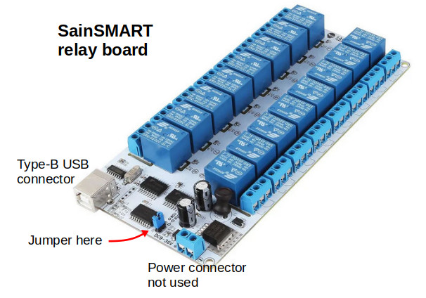
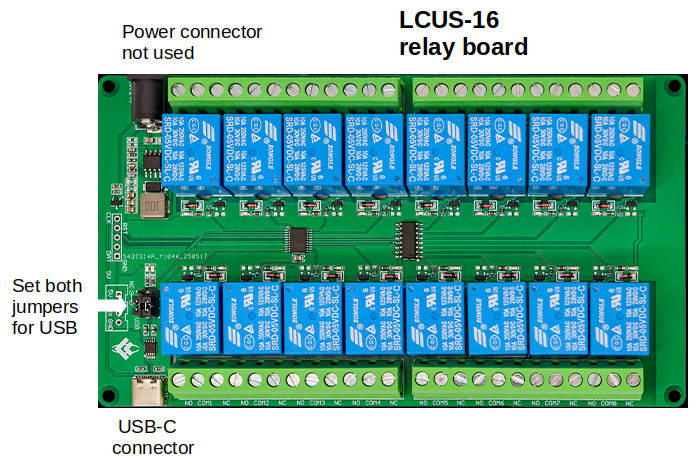

# relay-board
GUI for SainSMART and LCUS 16-channel serial relay boards

Stand-alone python GUIs for 16-channel relay boards from two different Chinese suppliers. The specific board can be identified in the photos below. There are no manufacturer model numbers and documentation for this hardware is almost non-existent. The needed hex command strings, however, were found from various online sources including reddit forums. If your board doesn't match either of the photos, the code in this repo is highly unlikely to work. 
  

Install <b>pyserial</b>, <b>tk-tools</b>, and possibly a driver for the CH-340 USB-serial interface. A USB interface cable (either Type-B or C depending on model) provides communication and board power. Use the jumpers to select the USB interface; the external DC power connection is not needed. I have no idea how to configure the COM option. Serial port selection is made using the button and Entry Box at the top of the GUI. 

This code was developed for an amateur radio antenna selector using Linux. There should be enough information in the comments to adapt it for other platforms and applications. In this application, there are two banks of relays. BANK 1 uses Relays 1--8 and BANK 2 uses Relays 9--15. Only one relay per bank can be selected, i.e. there are only two relays active simultaneously. 

The primary difference between the two programs involves serial communication. The LCUS module sends a response after every command, requiring that a delay be inserted or communication will fail. Some diagnostic information is sent to the terminal; diasble these as desired. There are certainly more compact and elegant ways to code this, but I wanted to make it transparent and easy to follow.

