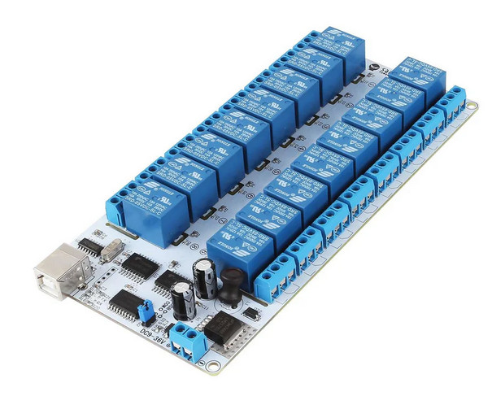

# relay-board
GUI for 16-channel SainSMART serial relay board

Stand-alone python GUI for a 16-channel SainSMART relay board as shown in the photo below. There is no manufacturer model number and documentation for this hardware is almost non-existent. The needed hex command strings, however, were found on the SainSMART wiki page. If your board doesn't match the photo, the code in this repo is highly unlikely to work. 
  

Install <b>pyserial</b> and possibly a driver for the CH-340 USB-serial interface. A Type-B USB interface cable provides communication and board power. Use the jumper to select the USB interface; the external DC power connection is not needed. I have no idea how to configure the COM option. Serial port selection is made using the button and Entry Box at the top of the GUI. 

This code was developed for an amateur radio antenna selector using Linux. There should be enough information in the comments to adapt it for other platforms and applications. In this application, there are two banks of relays. BANK 1 uses Relays 1--8 and BANK 2 uses Relays 9--15. Only one relay per bank can be selected, i.e. there are only two relays active simultaneously. 

There are certainly more compact and elegant ways to code this, but I wanted to make it transparent and easy to follow.

